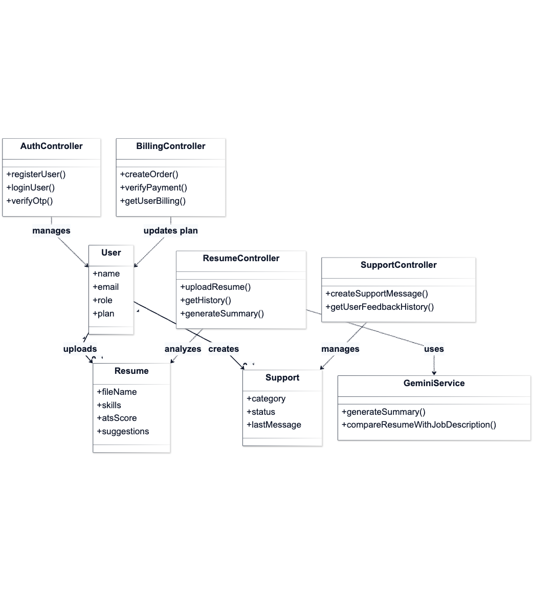
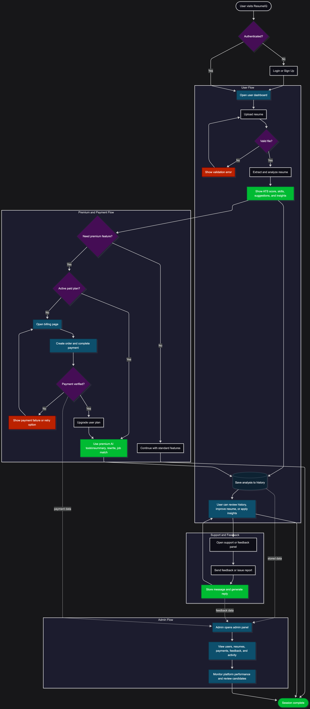
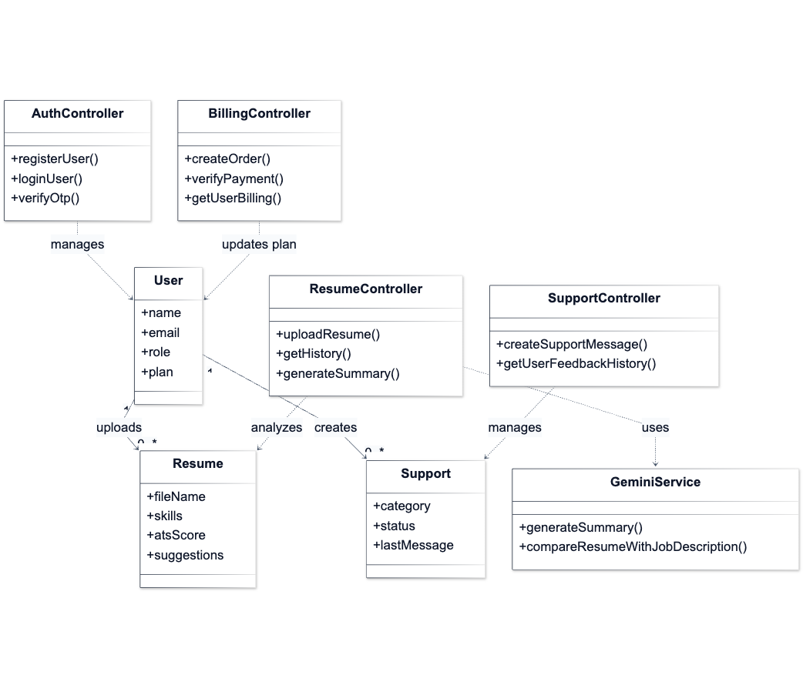

# ResumeIQ: AI Resume Analyzer and Job Matching Platform

ResumeIQ is a full-stack web application designed to help job seekers improve their resumes and help organizations evaluate candidate profiles more efficiently. The platform combines resume parsing, ATS-oriented analysis, AI-generated recommendations, job matching, candidate shortlisting, billing, and administrative monitoring in one system.

This project was developed as a final-year major project, but the product scope and implementation are structured in a way that is understandable for academic evaluation, portfolio review, and company-level technical screening.


## 1. Executive Summary

Modern hiring workflows are highly dependent on Applicant Tracking Systems (ATS), automated screening, and fast recruiter decision-making. Many candidates submit resumes without understanding whether their documents are ATS-friendly, keyword-aligned, or role-relevant. At the same time, recruiters and administrators often need better visibility into candidate quality, resume relevance, and plan-based service management.

ResumeIQ addresses this gap by providing:

- AI-assisted resume analysis
- ATS score estimation
- resume section quality checks
- skill extraction
- keyword and role matching
- AI-generated resume summary and rewrite support
- premium plan controls
- admin-side analytics and candidate filtering

The system is built with a React frontend and a Node.js/Express backend, with MongoDB as the primary data store.

## 2. Project Objective

The objective of this project is to build an intelligent resume management and analysis platform that:

- helps candidates understand the strength of their resumes before applying for jobs
- provides actionable feedback instead of only a numeric score
- supports AI-based improvements such as summary generation, career suggestions, and resume rewriting
- enables job-role and job-description matching
- gives administrators a centralized dashboard to monitor users, resumes, payments, support, and shortlisted candidates

In practical terms, ResumeIQ is positioned as both:

- a career support tool for end users
- a lightweight recruitment intelligence dashboard for organizations

## 3. Problem Statement

Candidates commonly face the following problems:

- they do not know whether their resume can pass ATS filters
- important skills may be missing or not properly highlighted
- resume structure may be weak even when the candidate has good technical ability
- job descriptions and resume keywords may not align
- they may not know which job roles best match their profile

Recruiters and organizations commonly face:

- high volume of resumes with inconsistent formatting
- limited visibility into candidate quality before manual review
- difficulty filtering candidates according to likely role fit
- the need for an internal view of usage, subscriptions, feedback, and shortlisted profiles

ResumeIQ is designed to reduce these inefficiencies using automation and structured AI-assisted analysis.

## 4. Key Features

### 4.1 Candidate-Side Features

#### Resume Upload and Validation

Users can upload resumes in supported document formats such as PDF and Word documents. The system validates the uploaded file and ensures that the content resembles a real resume before proceeding with analysis.

#### ATS Score Analysis

The platform calculates an ATS-oriented score to estimate how well the resume is likely to perform in automated screening systems. This score gives users a quick indication of resume quality and keyword readiness.

#### Skill Extraction

The backend extracts skills from the uploaded resume text and stores them for further analysis, matching, and administrative filtering.

#### Improvement Suggestions

The system generates suggestions to improve resume clarity, keyword density, and overall presentation. These recommendations are intended to be practical and immediately usable.

#### Resume Section Analysis

ResumeIQ checks whether important sections such as summary, skills, experience, education, projects, and certifications are present and meaningful.

#### Resume Strength Meter

The platform evaluates resume strength through multiple dimensions including:

- formatting
- content quality
- skills coverage
- ATS compatibility

This provides a more complete view than a single score alone.

#### Resume Ranking

The application includes resume ranking logic to estimate the relative standing of a resume and help users understand how competitive their profile appears.

#### AI Resume Summary

For eligible plans, the platform generates a structured professional summary based on the uploaded resume content.

#### Career Suggestions

The system suggests possible career roles based on extracted skills and profile context.

#### AI Resume Rewrite

Premium users can access AI-based resume rewrite support, which helps them convert raw or weak sections into stronger professional language.

#### Resume History

Users can review previously uploaded resumes and past analysis results, making the platform useful beyond a single upload session.

#### Job Description Matching

Premium users can compare their resume against a target job description to identify missing keywords and alignment gaps.

#### Billing and Subscription Experience

The platform supports plan-based usage limits and upgrade flows, including Free, Pro, and Premium access levels.

### 4.2 Admin-Side Features

#### Admin Dashboard

Administrators have access to a protected dashboard showing:

- total users
- total resumes uploaded
- plan distribution
- analytics trends
- feedback activity

#### Resume Management

Admins can view uploaded resumes, inspect candidate details, and retrieve stored resume files.

#### User Management

The admin panel supports browsing and filtering users with pagination and plan-aware visibility.

#### AI Candidate Matching

The system includes an admin-side candidate matching workflow that can match resumes against job role requirements.

#### Role-Based Resume Filtering

Admins can filter resumes by role categories such as backend, frontend, data analyst, marketing, and HR based on extracted skill keywords.

#### Candidate Shortlisting

Shortlisting functionality allows selected resumes to be tracked as promising candidates for future review.

#### Activity and Feedback Monitoring

The application records activity and support feedback so the admin can understand usage behavior and user issues.

### 4.3 Platform Services

#### Authentication and Security

The system supports:

- user registration
- login
- Google authentication
- OTP verification
- forgot password and reset password flow
- protected routes for authenticated users
- separate admin authorization

#### Support Module

Authenticated users can submit support or feedback messages, and the admin can monitor those messages from the dashboard.

#### Payment Integration

The platform includes Razorpay-based billing flow for paid plan upgrades.

## 5. Screenshots and Visual Documentation

The following visuals are included so reviewers can quickly understand the product and system design.

### User Interface Screenshots

#### Landing Page / Main Interface

<p align="center">
  
</p>

#### Resume Analysis Illustration

<p align="center">
  
</p>

#### AI Resume Intelligence Visual

<p align="center">
  
</p>

#### Additional Product Preview

<p align="center">
  
</p>

### Technical Documentation Visuals

#### Resume Management View

<p align="center">
  
</p>

#### System Flowchart

<p align="center">
  
</p>

#### Class Diagram

<p align="center">
  
</p>

## 6. User Roles in the System

### Candidate / End User

The end user can:

- create an account or log in
- upload and analyze resumes
- view ATS score and extracted skills
- generate suggestions and summaries
- access job matching features based on plan level
- review history and billing information
- submit support requests

### Administrator

The administrator can:

- view overall system statistics
- manage users and resumes
- filter candidate resumes by role relevance
- review support feedback
- monitor plan distribution and activity
- shortlist candidate profiles
- perform AI-based candidate matching tasks

## 7. System Workflow

The high-level workflow of the project is:

1. The user registers or logs in.
2. The user uploads a resume.
3. The backend extracts text from the uploaded file.
4. The system validates whether the uploaded document is likely to be a genuine resume.
5. Skills and important content signals are extracted.
6. ATS score and resume quality metrics are calculated.
7. Suggestions, summaries, and matching insights are generated based on user plan access.
8. Results are stored for history and admin review.
9. Administrators can inspect resumes, analytics, feedback, and shortlisted candidates.

## 8. Technical Architecture

ResumeIQ follows a clear client-server architecture.

### Frontend

- React 19
- Vite
- React Router
- Tailwind CSS
- Framer Motion
- Recharts
- Axios
- jsPDF

The frontend is responsible for:

- user interface and page navigation
- secure API communication
- dashboard and admin panel rendering
- report generation and presentation logic
- billing and plan-aware feature access

### Backend

- Node.js
- Express
- MongoDB with Mongoose
- Multer for file upload handling
- JWT for authentication
- Nodemailer for email workflows
- Razorpay for payment processing

The backend is responsible for:

- authentication and authorization
- resume upload and parsing
- skill extraction and scoring
- AI-powered suggestion workflows
- admin analytics and filtering
- payment verification
- support and activity management

### AI / Intelligent Processing

The backend includes utility modules for:

- ATS score calculation
- skill extraction
- keyword highlighting
- resume section analysis
- resume strength evaluation
- career suggestion generation
- AI summary generation
- AI resume rewriting

The codebase also contains integration points for external AI services through the backend utility layer.

## 9. Important Functional Modules

### Authentication Module

Handles registration, login, Google sign-in, OTP verification, password recovery, and user profile retrieval.

### Resume Analysis Module

Handles upload, text extraction, scoring, suggestions, ranking, section checks, and summary generation.

### Job Matching Module

Compares resume content with job requirements and highlights gaps or missing keywords.

### Admin Module

Provides user management, resume monitoring, analytics, feedback review, and shortlist support.

### Billing Module

Manages order creation, payment verification, billing history, and plan upgrades.

### Support Module

Stores and retrieves user support history and feedback messages.

## 10. Database Design

From the current codebase and diagrams, the platform centers around the following core entities:

- `User`
- `Resume`
- `Support`
- `SupportMessage`
- `Activity`
- `ShortlistedCandidate`
- `EmailVerification`

These entities support:

- account management
- uploaded resume records
- extracted skills and ATS scores
- activity tracking
- support conversations
- billing-linked plan state
- admin shortlisting workflow

## 11. Access Control and Plan Logic

The application uses plan-based feature access.

### Free Plan

- limited number of resume analyses
- access to core upload and analysis functions

### Pro Plan

- extended analysis capability
- access to premium resume intelligence such as AI summary and career suggestions

### Premium Plan

- access to advanced features such as job-description matching and AI resume rewrite

This design demonstrates not only technical implementation but also product thinking around feature gating and monetization.

## 12. Project Structure

```text
AI Resume/
├── client/                  # React frontend
│   ├── public/              # static images and assets
│   └── src/
│       ├── components/      # reusable UI components
│       ├── pages/           # candidate and admin pages
│       ├── services/        # API client
│       └── utils/           # frontend helpers
├── server/                  # Express backend
│   ├── controllers/         # route handlers
│   ├── middleware/          # auth, upload, plan checks
│   ├── models/              # MongoDB schemas
│   ├── routes/              # API routes
│   ├── uploads/             # uploaded resume files
│   └── utils/               # scoring, AI, parsing utilities
├── _Documentation/          # diagrams and documentation assets
├── README.md
└── vercel.json
```

## 13. Local Setup Instructions

### Prerequisites

- Node.js
- npm
- MongoDB connection

### Frontend Setup

```bash
cd client
npm install
npm run dev
```

### Backend Setup

```bash
cd server
npm install
node server.js
```

### Frontend Environment Variables

Create a `.env` file in the `client` directory and configure:

```env
VITE_API_URL=http://localhost:3001
VITE_GOOGLE_CLIENT_ID=your_google_client_id
VITE_RAZORPAY_KEY=your_razorpay_key
```

### Backend Environment Variables

Create a `.env` file in the `server` directory and configure:

```env
PORT=3001
MONGO_URI=your_mongodb_connection_string
JWT_SECRET=your_jwt_secret
CORS_ORIGIN=http://localhost:5173
GOOGLE_CLIENT_ID=your_google_client_id
SMTP_USER=your_email_user
SMTP_PASS=your_email_password
SMTP_HOST=your_smtp_host
SMTP_PORT=587
SMTP_FROM=your_sender_email
EMAIL_MODE=production
ADMIN_EMAILS=admin@example.com
RAZORPAY_KEY_ID=your_razorpay_key_id
RAZORPAY_KEY_SECRET=your_razorpay_secret
GROQ_API_KEY=your_ai_api_key
GROQ_MODEL=llama-3.1-8b-instant
GROQ_REWRITE_MODEL=llama-3.1-8b-instant
```

## 14. Deployment Notes

The repository contains `vercel.json` rewrite configuration for frontend routing, which allows SPA routes to resolve correctly when deployed.

For production deployment, the usual structure would be:

- frontend deployed on Vercel or a similar static hosting provider
- backend deployed on a Node.js-compatible server or cloud platform
- MongoDB hosted remotely
- environment variables configured in the deployment platform

## 15. Why This Project Matters

This project demonstrates more than a basic CRUD application. It shows the ability to design and implement:

- a complete full-stack architecture
- file upload and parsing workflows
- AI-assisted product features
- role-based access control
- payment integration
- analytics dashboards
- admin operations
- formal product-oriented thinking

For a company reviewing this project, ResumeIQ reflects practical understanding of how real software systems are structured around user workflows, business rules, and scalable feature separation.

## 16. Possible Future Enhancements

Potential future improvements include:

- live recruiter collaboration tools
- interview recommendation engine
- job portal integration
- advanced resume benchmarking across industries
- exportable recruiter reports
- stronger AI personalization for domain-specific resumes
- automated duplicate detection for uploaded resumes
- test coverage and CI/CD integration

## 17. Conclusion

ResumeIQ is a comprehensive AI-enabled resume analysis and job matching platform built to solve a real-world career and recruitment problem. It combines usability for candidates with operational visibility for administrators. The project demonstrates full-stack development skills, API design, data modeling, AI-assisted workflows, access control, and monetization-aware product architecture in one integrated solution.

It is suitable for academic presentation, portfolio showcasing, and professional project review because it clearly represents both technical capability and product thinking.
